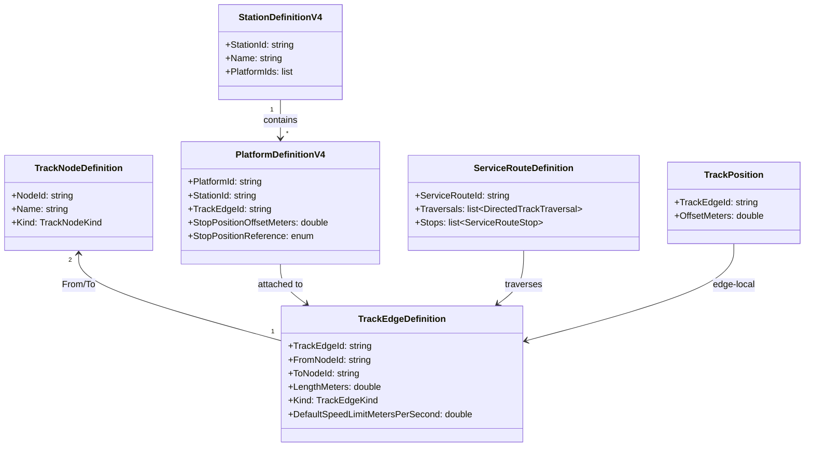

# MRT 路線進出站時間模擬器 V4.0.3 — 架構總覽

> 專案路徑：[`mrt-v403-integration`](file:///d:/AI/codex/mrt-v403-integration)
> 版本：V4.0.3（2026-09-28）　|　Runtime：.NET 10　|　UI：WPF　|　無第三方 NuGet

---

## 1. 專案概述

完全離線的 Windows 桌面軟體，用於建立**抽象捷運路線**的列車運行模擬，涵蓋：

- 雙向派車與發車計畫
- 資源占用、衝突預約與釋放
- 結構化營運事件
- 區間物理統計
- 移動閉塞安全監控
- 時間 — 里程列車運行圖
- CSV / PNG / PDF 匯出

定位為**營運與號誌概念模擬器**，非安全認證系統。

---

## 2. 技術堆疊

| 層級 | 技術 |
|---|---|
| 語言 | C# 13 / .NET 10 |
| UI 框架 | WPF（`net10.0-windows`） |
| Solution 格式 | `.slnx`（Visual Studio 2022+） |
| 版本來源 | [`Directory.Build.props`](file:///d:/AI/codex/mrt-v403-integration/Directory.Build.props) 的 `MrtVersion` |
| 外部依賴 | **零**（不使用第三方 NuGet） |
| 持久化 | 自定 JSON `.mrtsim.json`（Schema 8） |
| 測試框架 | 自建 Console Runner（非 xUnit/NUnit） |

---

## 3. Solution 結構

```
MrtRouteSimulator.slnx
├── src/
│   ├── MrtRouteSimulator.Engine/     ← 核心引擎（.NET 10 class library）
│   └── MrtRouteSimulator.App/        ← WPF 桌面應用程式
├── tests/
│   ├── MrtRouteSimulator.Tests/              ← Engine 自動化（185 tests）
│   ├── MrtRouteSimulator.WpfTests/           ← WPF 離屏驗證
│   ├── MrtRouteSimulator.PlaybackBenchmarks/ ← 播放效能基準
│   └── MrtRouteSimulator.Performance/        ← Engine 效能基準
├── samples/                          ← 14 份 Schema 8 範例
├── docs/                             ← 驗收證據與進度文件
└── artifacts/                        ← QA 輸出
```

---

## 4. 分層架構

```mermaid
graph TD
    subgraph "MrtRouteSimulator.App（WPF 前端）"
        MW["MainWindow<br/>（partial classes）"]
        PW["SimulationPlaybackWorker<br/>（single-writer）"]
        TE["TopologyEditorWindow"]
        DS["DiagramExportService"]
        IS["InterfaceScaleService"]
        RA["SimulationResultAccumulator"]
        SS["StationSchematicPresentation"]
        TD["TimeDistanceTrajectoryCache"]
    end

    subgraph "MrtRouteSimulator.Engine（核心引擎）"
        SW["SimulationWorld<br/>（V2 主模擬迴圈）"]
        SE["SimulationEngine<br/>（V1 解析模型）"]
        IG["InfrastructureGraphV4<br/>（track-first topology）"]
        TR["TopologyRuntime<br/>（movement navigator）"]
        SR["ServiceRouteModels<br/>（ResolvedStopResolver）"]
        SP["SimulationProject<br/>（JSON 序列化）"]
        SS2["SimulationSession"]
        BK["BrakingEnvelopeCalculator"]
        SC["StationStopController"]
        TSL["TrackSpeedLimitService"]
        IS2["IntervalStatistics"]
        OT["OperationsTimetable"]
        RC["TopologyResultContext"]
        RP["RouteProjection"]
        TF["TopologyProjectFactory"]
        PF["TopologyPathFinder"]
        LB["LinearInfrastructureBuilder"]
        AM["AnalyticalModel（V1）"]
        PM["PlanningModels"]
    end

    MW --> PW
    MW --> TE
    MW --> DS
    PW --> SW
    RA --> SW

    SW --> IG
    SW --> TR
    SW --> SR
    SW --> BK
    SW --> SC
    SW --> TSL
    SW --> RC

    SS2 --> SW
    TF --> IG
    TF --> SR
    LB --> IG

    SP --> SW
    SP --> IG

    IS2 --> RC
    OT --> RC
    DS --> TD

    SE --> AM
```



---

## 5. Engine 核心模組詳解

### 5.1 資料模型層

| 檔案 | 責任 |
|---|---|
| [`Models.cs`](file:///d:/AI/codex/mrt-v403-integration/src/MrtRouteSimulator.Engine/Models.cs) | V1 基礎型別：`Route`、`Station`、`TrainParameters`、`SegmentTravelResult`、`StationEvent` |
| [`V2Models.cs`](file:///d:/AI/codex/mrt-v403-integration/src/MrtRouteSimulator.Engine/V2Models.cs) | V2 枚舉與型別：`OperationalPhase`、`SafetyStatus`、`SimulationEventType`、`TrajectorySample`、`SafetyObservation` |
| [`TopologyModels.cs`](file:///d:/AI/codex/mrt-v403-integration/src/MrtRouteSimulator.Engine/TopologyModels.cs) | V4 track-first 拓樸：`TrackNodeDefinition`、`TrackEdgeDefinition`、`StationDefinitionV4`、`PlatformDefinitionV4`、`TurnbackFacilityDefinition`、`PassingFacilityDefinition`、`TrackPosition`、`DirectedTrackTraversal`、`DirectedTrackConnectionDefinition`、`TopologyInfrastructureDefinition` |
| [`ServiceRouteModels.cs`](file:///d:/AI/codex/mrt-v403-integration/src/MrtRouteSimulator.Engine/ServiceRouteModels.cs) | 營運路線：`ServiceRouteDefinition`、`ServiceRouteStop`、`ResolvedStop`、`ResolvedStopResolver` |
| [`PlanningModels.cs`](file:///d:/AI/codex/mrt-v403-integration/src/MrtRouteSimulator.Engine/PlanningModels.cs) | 車型 / 服務 / 派車：`VehicleTypeDefinition`、`ServiceTypeDefinition`、`ServicePattern`、`ServiceRunPlan`、`PlannedServiceRun`、`ResolvedDispatchPlan` |
| [`InfrastructureModels.cs`](file:///d:/AI/codex/mrt-v403-integration/src/MrtRouteSimulator.Engine/InfrastructureModels.cs) | Legacy `InfrastructureGraph`、站場分類與設施模型 |
| [`SpatialReferencePointModels.cs`](file:///d:/AI/codex/mrt-v403-integration/src/MrtRouteSimulator.Engine/SpatialReferencePointModels.cs) | URCS 五類空間參考點 |

### 5.2 核心引擎

| 檔案 | 責任 |
|---|---|
| [`SimulationWorld.cs`](file:///d:/AI/codex/mrt-v403-integration/src/MrtRouteSimulator.Engine/SimulationWorld.cs)（6,673 行） | **V2 主模擬迴圈**：固定 0.1s Tick、多列車狀態推進、topology movement、資源預約/釋放、移動閉塞、煞車控制、事件產生 |
| [`SimulationEngine.cs`](file:///d:/AI/codex/mrt-v403-integration/src/MrtRouteSimulator.Engine/SimulationEngine.cs) | V1 解析模型引擎（三角形/梯形速度曲線） |
| [`SimulationSession.cs`](file:///d:/AI/codex/mrt-v403-integration/src/MrtRouteSimulator.Engine/SimulationSession.cs) | `SimulationWorldOptions` → `CreateWorld()`；統一實際/計畫 world 建構 |
| [`BrakingEnvelopeCalculator.cs`](file:///d:/AI/codex/mrt-v403-integration/src/MrtRouteSimulator.Engine/BrakingEnvelopeCalculator.cs) | Jerk 受限動態煞車包絡線 |
| [`StationStopController.cs`](file:///d:/AI/codex/mrt-v403-integration/src/MrtRouteSimulator.Engine/StationStopController.cs) | 進站煞車策略：高速距離-速度曲線 → 12m 低速精停 |

### 5.3 Topology Runtime

| 檔案 | 責任 |
|---|---|
| [`InfrastructureGraphV4.cs`](file:///d:/AI/codex/mrt-v403-integration/src/MrtRouteSimulator.Engine/InfrastructureGraphV4.cs) | V4 track-first aggregate：節點/邊/月台/資源/速限/坡度/曲線索引 |
| [`TopologyRuntime.cs`](file:///d:/AI/codex/mrt-v403-integration/src/MrtRouteSimulator.Engine/TopologyRuntime.cs)（932 行） | `TopologyMovementNavigator`：所有 mainline / crossover / tail / pocket / passing 共用的 traversal engine；`RuntimeTopologyCursor`、`TopologyMovementFootprint` |
| [`TopologyPathFinder.cs`](file:///d:/AI/codex/mrt-v403-integration/src/MrtRouteSimulator.Engine/TopologyPathFinder.cs) | 路徑搜尋，遵循 `DirectedTrackConnection` 限制 |
| [`LinearInfrastructureBuilder.cs`](file:///d:/AI/codex/mrt-v403-integration/src/MrtRouteSimulator.Engine/LinearInfrastructureBuilder.cs) | 快速表單 → 線性 topology（自動補齊尾軌/折返資源） |
| [`RouteProjection.cs`](file:///d:/AI/codex/mrt-v403-integration/src/MrtRouteSimulator.Engine/RouteProjection.cs) | ServiceRoute → 累積 chainage（僅供顯示，不參與物理） |
| [`TopologyProjectFactory.cs`](file:///d:/AI/codex/mrt-v403-integration/src/MrtRouteSimulator.Engine/TopologyProjectFactory.cs) | Schema 8 JSON → `TopologySimulationDefinition` |
| [`TopologyResultContext.cs`](file:///d:/AI/codex/mrt-v403-integration/src/MrtRouteSimulator.Engine/TopologyResultContext.cs) | 結果層消費：resolved stops → 時刻表/統計/匯出 |
| [`DirectedTrackConnectionRules.cs`](file:///d:/AI/codex/mrt-v403-integration/src/MrtRouteSimulator.Engine/DirectedTrackConnectionRules.cs) | 道岔轉向限制共用邏輯 |
| [`TrackSpeedLimitService.cs`](file:///d:/AI/codex/mrt-v403-integration/src/MrtRouteSimulator.Engine/TrackSpeedLimitService.cs) | edge-local 速限評估與提前煞車 |

### 5.4 分析與輸出服務

| 檔案 | 責任 |
|---|---|
| [`AnalyticalModel.cs`](file:///d:/AI/codex/mrt-v403-integration/src/MrtRouteSimulator.Engine/AnalyticalModel.cs) | V1 三角形/梯形解析 |
| [`IntervalStatistics.cs`](file:///d:/AI/codex/mrt-v403-integration/src/MrtRouteSimulator.Engine/IntervalStatistics.cs) | 區間統計（平均/極值/P95/移動閉塞受限秒） |
| [`OperationsTimetable.cs`](file:///d:/AI/codex/mrt-v403-integration/src/MrtRouteSimulator.Engine/OperationsTimetable.cs) | 進出站時刻表 |
| [`V1V2Comparison.cs`](file:///d:/AI/codex/mrt-v403-integration/src/MrtRouteSimulator.Engine/V1V2Comparison.cs) | V1/V2 同條件逐站比較 |
| [`TrajectoryAnalysis.cs`](file:///d:/AI/codex/mrt-v403-integration/src/MrtRouteSimulator.Engine/TrajectoryAnalysis.cs) | 軌跡分析 |
| [`ResourceOccupancyAnalysis.cs`](file:///d:/AI/codex/mrt-v403-integration/src/MrtRouteSimulator.Engine/ResourceOccupancyAnalysis.cs) | 資源占用與觀測容量 |
| [`SpatialCapacityAnalysis.cs`](file:///d:/AI/codex/mrt-v403-integration/src/MrtRouteSimulator.Engine/SpatialCapacityAnalysis.cs) | URCS 容量分析 |

### 5.5 持久化與驗證

| 檔案 | 責任 |
|---|---|
| [`SimulationProject.cs`](file:///d:/AI/codex/mrt-v403-integration/src/MrtRouteSimulator.Engine/SimulationProject.cs)（689 行） | `.mrtsim.json` Schema 8 讀寫、升版（7→8）、原子存檔 |
| [`TopologyProject.cs`](file:///d:/AI/codex/mrt-v403-integration/src/MrtRouteSimulator.Engine/TopologyProject.cs) | Topology 專案格式 |
| [`Validation.cs`](file:///d:/AI/codex/mrt-v403-integration/src/MrtRouteSimulator.Engine/Validation.cs) | 路線/參數通用驗證 |
| [`InfrastructureValidator.cs`](file:///d:/AI/codex/mrt-v403-integration/src/MrtRouteSimulator.Engine/InfrastructureValidator.cs) | Topology 完整性驗證 |
| [`StationConstructionRules.cs`](file:///d:/AI/codex/mrt-v403-integration/src/MrtRouteSimulator.Engine/StationConstructionRules.cs) | 站場建置規則 |
| [`FixedTimetableArchive.cs`](file:///d:/AI/codex/mrt-v403-integration/src/MrtRouteSimulator.Engine/FixedTimetableArchive.cs) | Legacy 固定時刻表封存 |
| [`LegacyPortMigration.cs`](file:///d:/AI/codex/mrt-v403-integration/src/MrtRouteSimulator.Engine/LegacyPortMigration.cs) | Legacy Schema 7 → Schema 8 移轉 |

---

## 6. WPF App 模組詳解

[`MainWindow.xaml.cs`](file:///d:/AI/codex/mrt-v403-integration/src/MrtRouteSimulator.App/MainWindow.xaml.cs) 採 **partial class** 拆分：

| Partial 檔案 | 責任 |
|---|---|
| `MainWindow.xaml.cs` | 視窗初始化、頁面切換、建模觸發 |
| `MainWindow.V2.cs` | V2 引擎整合、播放控制 |
| `MainWindow.Topology.cs` | Topology 專案入口 |
| `MainWindow.PlaybackRefresh.cs` | 播放 UI 刷新策略 |
| `MainWindow.ProjectFiles.cs` | 存讀檔、匯出 |
| `MainWindow.InputEditors.cs` | 輸入草稿交易 |
| `MainWindow.TimeDistance.cs` | 運行圖繪製 |
| `MainWindow.IntervalStatistics.cs` | 區間統計頁 |
| `MainWindow.V3Results.cs` | V3 結果頁整合 |
| `MainWindow.InterfaceScale.cs` | 介面縮放 |
| `MainWindow.ShellScroll.cs` | 外層捲動 |
| `MainWindow.WorkspaceNavigation.cs` | 工作區導覽 |
| `MainWindow.NativeAcceptance.cs` | 原生桌面驗收 |
| `MainWindow.FixedTimetableArchive.cs` | 固定時刻表封存 UI |
| `MainWindow.SpatialReferencePointDiagram.cs` | 參考點圖形 |
| `MainWindow.SpatialReferencePointEditors.cs` | 參考點編輯 |

其他 App 關鍵元件：

| 檔案 | 責任 |
|---|---|
| [`SimulationPlaybackWorker.cs`](file:///d:/AI/codex/mrt-v403-integration/src/MrtRouteSimulator.App/SimulationPlaybackWorker.cs) | Single-writer 播放 worker：immutable frame snapshot、背景計畫、增量結果、分級 UI 刷新 |
| [`SimulationResultAccumulator.cs`](file:///d:/AI/codex/mrt-v403-integration/src/MrtRouteSimulator.App/SimulationResultAccumulator.cs) | 增量結果累積 |
| [`DiagramExportService.cs`](file:///d:/AI/codex/mrt-v403-integration/src/MrtRouteSimulator.App/DiagramExportService.cs) | PNG / PDF / CSV 匯出 |
| [`TopologySchematicGeometry.cs`](file:///d:/AI/codex/mrt-v403-integration/src/MrtRouteSimulator.App/TopologySchematicGeometry.cs) | 配線圖幾何計算 |
| [`StationSchematicPresentation.cs`](file:///d:/AI/codex/mrt-v403-integration/src/MrtRouteSimulator.App/StationSchematicPresentation.cs) | 站場配線圖呈現 |
| [`TopologyEditorWindow.cs`](file:///d:/AI/codex/mrt-v403-integration/src/MrtRouteSimulator.App/TopologyEditorWindow.cs) | Topology 編輯器視窗 |
| [`TimeDistanceTrajectoryCache.cs`](file:///d:/AI/codex/mrt-v403-integration/src/MrtRouteSimulator.App/TimeDistanceTrajectoryCache.cs) | 運行圖軌跡快取 |
| [`InterfaceScaleService.cs`](file:///d:/AI/codex/mrt-v403-integration/src/MrtRouteSimulator.App/InterfaceScaleService.cs) | 介面縮放偏好（80%–125%） |
| [`AppDisplayPreferences.cs`](file:///d:/AI/codex/mrt-v403-integration/src/MrtRouteSimulator.App/AppDisplayPreferences.cs) | 本機顯示設定持久化 |

---

## 7. 核心資料流

```mermaid
flowchart LR
    subgraph Input
        JSON["`.mrtsim.json`<br/>Schema 8"]
        QS["快速起稿表單"]
    end

    subgraph Build
        TF["TopologyProjectFactory"]
        LB["LinearInfrastructureBuilder"]
        IG["InfrastructureGraphV4"]
        SR["ServiceRoute +<br/>ResolvedStopResolver"]
        DP["ResolvedDispatchPlan"]
    end

    subgraph Simulate
        WO["SimulationWorldOptions"]
        SW["SimulationWorld<br/>0.1s fixed tick"]
    end

    subgraph Output
        PW["PlaybackWorker<br/>immutable frames"]
        RC["TopologyResultContext"]
        TT["時刻表"]
        STAT["區間統計"]
        TD["運行圖"]
        EX["CSV / PNG / PDF"]
    end

    JSON --> TF --> IG
    QS --> LB --> IG
    IG --> SR
    SR --> DP
    IG --> WO
    SR --> WO
    DP --> WO
    WO --> SW
    SW --> PW
    SW --> RC
    RC --> TT
    RC --> STAT
    RC --> TD
    TD --> EX
    TT --> EX
    STAT --> EX
```

---

## 8. 核心領域模型

### 8.1 Track-first Topology（V4 權威座標系）



### 8.2 V2 模擬 Runtime 座標

| 概念 | 型別 | 說明 |
|---|---|---|
| 權威位置 | `TrackEdgeId + OffsetMeters + TraversalIndex` | edge-local，不是全線 km |
| Movement cursor | `RuntimeTopologyCursor` | Movement plan / leg / traversal 內的位置 |
| 列車 footprint | `TopologyMovementFootprint` | 車頭+車尾+跨 edge 占用 |
| 顯示用 chainage | `PositionMeters`（投影快取） | 由 `RouteProjection` 衍生 |

### 8.3 營運規劃

```
VehicleTypeDefinition ──→ 物理性能（長度/最高速/加減速/Jerk/惰行）
ServiceTypeDefinition ──→ 營運屬性（優先序/越行/色碼/前綴）
ServicePattern        ──→ 停站/跨站/折返逐站指令
PlannedServiceRun     ──→ 單一班次（方向/時間/車型/停站模式/接續）
ResolvedDispatchPlan  ──→ 完整雙向班表解析結果
```

---

## 9. 關鍵演算法與機制

### 9.1 模擬迴圈

- **固定 0.1 秒 Tick**：`SimulationWorld.Step()` 逐步推進所有列車
- 每 Tick：加速/巡航/惰行 → 煞車包絡線 → 進站控制 → 移動閉塞 → 資源衝突 → 事件紀錄

### 9.2 移動閉塞

- **三模式**：獨立 / 監視（告警）/ 控制（防追撞）
- 控制模式：動態安全距離 + 移動授權 → 前車淨空不足時限速/煞停

### 9.3 資源預約

- `RouteResourceReservationManager`：明確預約、衝突等待、車尾離開後釋放
- 適用：月台、進路、尾軌、袋狀軌、渡線、越行設施

### 9.4 折返與越行

- **折返**：尾軌 / 袋狀軌 / 站前渡線 / 站後渡線 / 中央避車線，均由 `DirectedTrackTraversal` 實體推進
- **越行**：候選搜尋 → 資源預約 → 普通車待避 → 快速車通過線超越 → 車尾淨空放行

### 9.5 進站煞車

- `BrakingEnvelopeCalculator`：Jerk 受限動態煞車曲線
- `StationStopController`：高速階段追蹤煞車曲線 → 12m 切入低速精停（≤3 m/s） → 2m 吸附

---

## 10. 持久化格式

| 格式 | 用途 |
|---|---|
| `.mrtsim.json`（Schema 8） | 主專案：topology + 營運 + 模擬設定（原子存檔） |
| `.mrttimetable.json` | Legacy Schema 7 固定時刻表封存（唯讀） |
| `display-settings.json` | 本機介面縮放偏好 |

Schema 版本策略：
- Schema 8：現行格式（V4.0.0+）
- Schema 7：讀取時自動升級為 Schema 8
- Schema 1–6：明確拒絕

---

## 11. 測試架構

| 測試專案 | 範圍 | 數量 |
|---|---|---|
| [`MrtRouteSimulator.Tests`](file:///d:/AI/codex/mrt-v403-integration/tests/MrtRouteSimulator.Tests) | Engine 核心：topology regression、折返/越行/資源/速限/待避/Schema 8 往返 | 185 |
| [`MrtRouteSimulator.WpfTests`](file:///d:/AI/codex/mrt-v403-integration/tests/MrtRouteSimulator.WpfTests) | WPF 離屏：範例載入、播放 worker、速度曲線、運行圖、匯出、DPI、介面縮放 | ~50 |
| [`MrtRouteSimulator.PlaybackBenchmarks`](file:///d:/AI/codex/mrt-v403-integration/tests/MrtRouteSimulator.PlaybackBenchmarks) | 播放效能基準（60× 倍率診斷） | — |
| [`MrtRouteSimulator.Performance`](file:///d:/AI/codex/mrt-v403-integration/tests/MrtRouteSimulator.Performance) | Engine-only 吞吐量基準 | — |

關鍵測試檔案：

- [`TopologyRegressionTests.cs`](file:///d:/AI/codex/mrt-v403-integration/tests/MrtRouteSimulator.Tests/TopologyRegressionTests.cs)：topology 完整情境
- [`TopologyTurnbackRegressionTests.cs`](file:///d:/AI/codex/mrt-v403-integration/tests/MrtRouteSimulator.Tests/TopologyTurnbackRegressionTests.cs)：折返回歸
- [`SyntheticLongRouteScenarioTests.cs`](file:///d:/AI/codex/mrt-v403-integration/tests/MrtRouteSimulator.Tests/SyntheticLongRouteScenarioTests.cs)：28 站大型合成路線
- [`NativeAcceptanceTests.cs`](file:///d:/AI/codex/mrt-v403-integration/tests/MrtRouteSimulator.WpfTests/NativeAcceptanceTests.cs)：原生桌面驗收

---

## 12. 版本沿革

| 版本 | 日期 | 里程碑 |
|---|---|---|
| v1.0.0 | 2026-08-19 | V1 解析模型 + WPF |
| v2.0.0 | 2026-08-19 | V2 SimulationWorld、移動閉塞、運行圖 |
| v2.1.0 | 2026-08-20 | 存讀檔、服務模式、Jerk 煞停 |
| v3.3.0 | 2026-08-24 | Schema 7、車型/服務目錄、派車計畫 |
| v4.0.1 | 2026-08-31 | Track-first topology、Schema 8、配線圖 |
| v4.0.2 | 2026-09-20 | 播放穩定性、合成大型路線、parallel worker |
| **v4.0.3** | **2026-09-28** | **折返實體發車、大型工作區編輯、設施速限連續性** |

---

## 13. 設計決策摘要

| 決策 | 理由 |
|---|---|
| **零外部依賴** | 離線桌面軟體，避免 NuGet 供應鏈風險 |
| **track-first topology** | 車站不再是端點；所有物理以 `TrackEdgeId + Offset` 為權威 |
| **固定 0.1s Tick** | 確保 Jerk 受限物理的數值穩定性 |
| **immutable frame snapshot** | 播放 worker 與 UI 解耦，避免讀寫衝突 |
| **RouteProjection 僅供顯示** | chainage 不參與物理/安全，防止 loop 路線的座標歧義 |
| **原子存檔** | 暫存檔 → 取代，避免半成品覆蓋 |
| **草稿交易** | 取消編輯不修改目前專案 |
| **Console Runner 自建測試** | 不依賴 xUnit/NUnit，與零外部依賴一致 |
